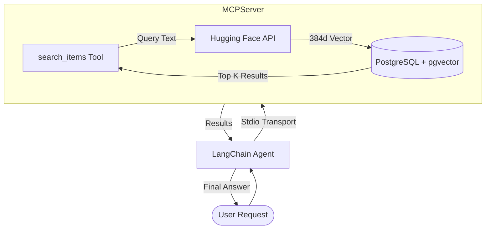

# MCP Server with PGVector and LangChain Agent

A powerful demonstration of the **Model Context Protocol (MCP)** integrated with **PostgreSQL (pgvector)** and **Hugging Face** for natural language vector search.

This project consists of an MCP Server that provides vector search capabilities and a LangChain Agent that utilizes those tools to answer user questions.

---

## 🚀 Overview

- **MCP Server**: Built using the `@modelcontextprotocol/sdk`, it exposes a `search_items` tool. It generates embeddings on-the-fly using Hugging Face's `all-MiniLM-L6-v2` model and performs similarity searches against a PostgreSQL database.
- **Agent**: A LangChain-powered agent using Groq's Llama-3 model. It connects to the MCP server via Standard I/O (Stdio), discovers available tools, and uses them to fulfill search requests.
- **Database**: PostgreSQL with the `pgvector` extension for efficient nearest-neighbor searches.

## 🛠️ Tech Stack

- **Model Context Protocol (MCP)**: The interface between LLM and tools.
- **Groq (Llama 3.1 8B)**: The "brain" that reasoning about tool usage.
- **Hugging Face Inference**: Generates semantic embeddings (384-dimensional).
- **LangChain**: Orchestrates the agent, tools, and prompts.
- **PostgreSQL + pgvector**: Stores and queries high-dimensional vectors.

---

## 🏗️ Architecture



---

## 📖 Deep Dive: How it Works

### 1. The Embedding Layer
When you search for "machine learning", the query isn't matched against strings. Instead:
1. The **MCP Server** sends your text to Hugging Face.
2. The `all-MiniLM-L6-v2` model converts it into a **384-dimensional vector** (array of floats).
3. This vector represents the *semantic meaning* of your query.

### 2. The Vector Search
The server uses the `pgvector` operator `<->` (L2 Distance) to find items in the database that are "closest" to your query vector.
```sql
SELECT id, name FROM items
ORDER BY embedding <-> $1
LIMIT 5;
```

### 3. The Agentic Reasoning
The LangChain agent doesn't just run a script. It follows a **ReAct** (Reasoning + Acting) pattern:
1. **Thought**: "The user wants to find items related to X. I should use the `search_items` tool."
2. **Action**: Call `search_items(query="X")`.
3. **Observation**: Receive JSON results from the database.
4. **Thought**: "I have the results. Now I will summarize them for the user."
5. **Final Answer**: A human-friendly response.

---

## 🏗️ Setup Guide

### 1. Prerequisites
- [Node.js](https://nodejs.org/) (v18+)
- [PostgreSQL](https://www.postgresql.org/) with [pgvector](https://github.com/pgvector/pgvector) installed.

### 2. Database Setup
```sql
-- Enable the extension
CREATE EXTENSION IF NOT EXISTS vector;

-- Create table with 384 dimensions (specific to all-MiniLM-L6-v2)
CREATE TABLE items (
    id SERIAL PRIMARY KEY,
    name TEXT NOT NULL,
    embedding vector(384)
);

-- Example Insertion (Generating vectors externally)
INSERT INTO items (name, embedding) VALUES ('Vector Database', '[0.12, -0.05, ...]');
```

### 3. Installation
```bash
npm install
```

### 4. Configuration
Create a `.env` file:
```env
DB_HOST=localhost
DB_PORT=5432
DB_NAME=your_db
DB_USER=your_user
DB_PASSWORD=your_password

HF_API_KEY=your_huggingface_token
GROQ_API_KEY=your_groq_api_key
```

---

## 🏃 Running the Project

Run the agent, which internally spawns the MCP server:
```bash
node ./agents/agent.js
```

### Example Interaction
**Input**: "Find me some AI tools"
**Agent Activity**:
1. Connects to `mcp-server/index.js` via stdio.
2. Discovers `search_items`.
3. Calls the tool with query "AI tools".
4. Server generates embedding, queries DB, returns results.
5. Agent presents the results.

---

## �️ Advanced: Adding Custom Tools

You can extend the `mcp-server/index.js` to include more tools. Simply define them in the `tools` array and add a handler in `CallToolRequestSchema`:

```javascript
const tools = [
  {
    name: "add_item",
    description: "Add a new item to the database with auto-embedding",
    inputSchema: { ... }
  }
];
```

---

## ⚠️ Troubleshooting

- **Malformed Vector Literal**: Ensure your query embedding is formatted as `[1,2,3]` (with brackets) when sending to PostgreSQL.
- **MCP Tool Error**: If you see `tool_use_failed`, check `console.error` logs in the server. Do not use `console.log` as it breaks the Stdio protocol.
- **Hugging Face 410 Error**: Ensure you are using the latest `@huggingface/inference` package (>= 2.x) to use the new `router.huggingface.co` endpoints.

---

## 📜 License
ISC
