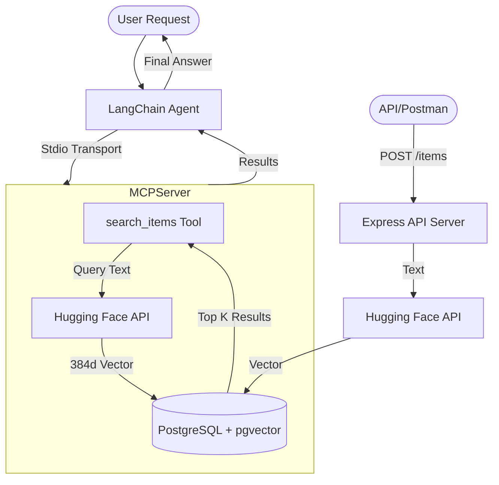

# MCP PGVector: AI Agent & API Server

A high-performance implementation of the **Model Context Protocol (MCP)** integrated with **PostgreSQL (pgvector)** and **LangChain**. This project provides a semantic search engine capable of storing and retrieving high-dimensional vector data through both a REST API and an autonomous AI Agent.

---

## 🌟 Features

- **Autonomous AI Agent**: powered by LangChain and Groq (Llama 3.1), capable of reasoning about tool usage.
- **MCP Infrastructure**: Standardized tool discovery and execution using the Model Context Protocol.
- **REST & Agent API**: Express server providing endpoints for bulk data ingestion and AI-powered natural language search.
- **Seamless Embeddings**: Automatic vector generation using Hugging Face's `all-MiniLM-L6-v2` (384-dimensional).
- **Vector DB**: Leverages PostgreSQL `pgvector` for advanced similarity searches (`<->` operator).

---

## 🏗️ Architecture



---

## 🚀 Getting Started

### 1. Prerequisites
- **Node.js** (v18+)
- **PostgreSQL** with the [pgvector](https://github.com/pgvector/pgvector) extension installed.

### 2. Database Setup
Run the following SQL in your PostgreSQL instance:
```sql
-- Enable the vector extension
CREATE EXTENSION IF NOT EXISTS vector;

-- Create the items table
CREATE TABLE items (
    id SERIAL PRIMARY KEY,
    name TEXT NOT NULL,
    embedding vector(384)
);
```

### 3. Installation & Configuration
Clone the repository and install dependencies:
```bash
npm install
```

Create a `.env` file in the root directory:
```env
DB_HOST=localhost
DB_PORT=5432
DB_NAME=postgres
DB_USER=postgres
DB_PASSWORD=your_password

HF_API_KEY=hf_...
GROQ_API_KEY=gsk_...
```

---

## 🏃 Running the Project

### 🌐 Start the Full API Server
This starts the Express server which hosts both the REST endpoints and the LangChain Agent.
```bash
npm run api
```

### 🤖 Run the CLI Agent
Direct terminal access to the AI agent:
```bash
# Default query
npm run agent

# Custom query
node agents/agent.js "Find tools for high-performance frontend"
```

---

## 📋 API Documentation

### **Agent Endpoints (AI-Powered)**
| Endpoint | Method | Description | Payload |
| :--- | :--- | :--- | :--- |
| `/ask` | `POST` | Semantic search with AI summary | `{ "query": "..." }` |
| `/chat` | `POST` | General commands (e.g., "Add X to database") | `{ "message": "..." }` |

### **REST Endpoints (Data Management)**
| Endpoint | Method | Description | Payload |
| :--- | :--- | :--- | :--- |
| `/items` | `POST` | Ingest single or array of items | `[{ "name": "React" }, { "name": "Vue" }]` |
| `/items` | `GET` | List all records (paginated) | `?limit=50` |
| `/search` | `GET` | Raw vector search (No AI summary) | `?query=database` |

---

## 🛠️ Project Structure

- **`api/server.js`**: Express server & entry point for all endpoints.
- **`mcp-server/index.js`**: The MCP Server implementation (logic for DB & Embeddings).
- **`agents/agent_logic.js`**: Shared LangChain reasoning logic.
- **`agents/agent.js`**: CLI wrapper for the agent.

---

## ⚠️ Troubleshooting

- **404 /ask Error**: If you see this, ensure no old server processes are hogging the port. Restart the server with `npm run api`.
- **Vector Mismatch**: Ensure your table uses `vector(384)` to match the Hugging Face `all-MiniLM-L6-v2` model.
- **Logging**: MCP uses `stdout` for communication; use `console.error` for custom server logging to avoid breaking the protocol.

---

## 📜 License
ISC
